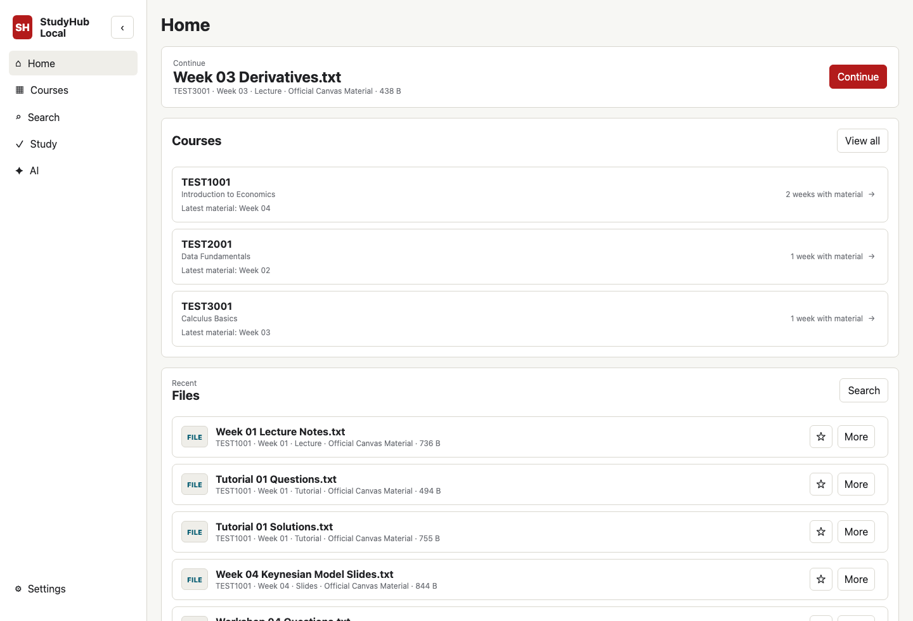
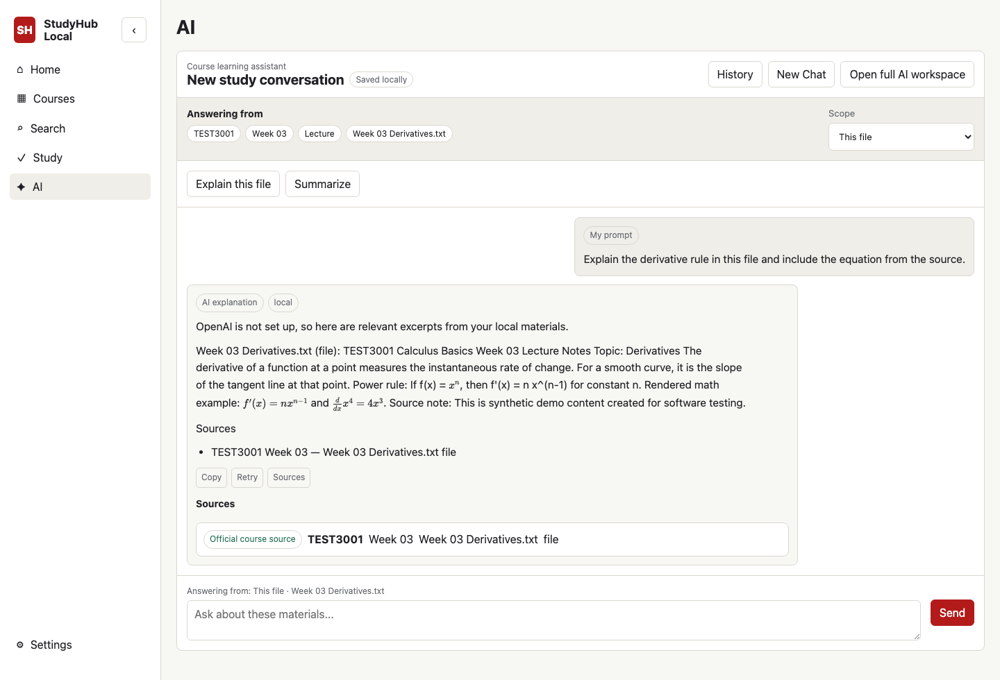
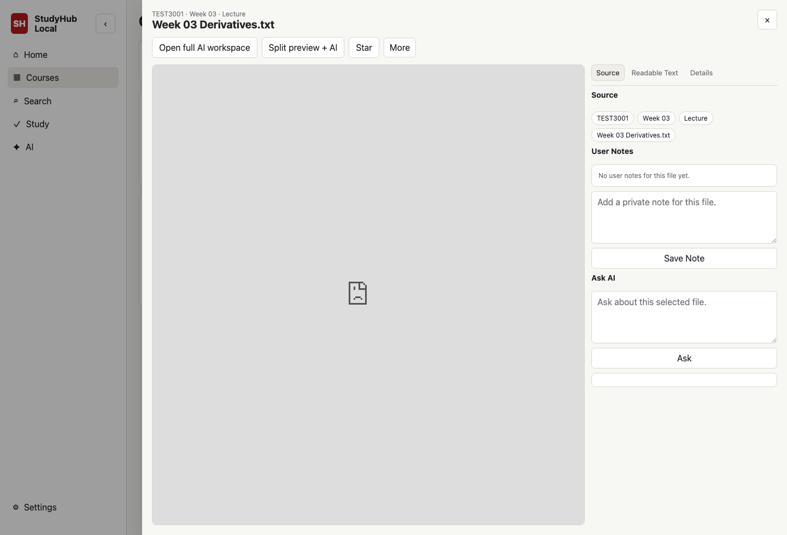

# StudyHub Local

[](https://github.com/langming58-hash/studyhub-local/releases/tag/v0.1.5)
[](LICENSE)
[](https://github.com/langming58-hash/studyhub-local/actions/workflows/ci.yml)


StudyHub Local is a local-first study workspace for your own course files.

It works with any university. Your university does not need to provide an API.
StudyHub is currently a local application that runs on your computer.

This early-stage project helps you browse course files by Course -> Week, preview
materials, search your own study library, keep notes and review records, and
optionally ask AI questions grounded in your own materials.

Your original files stay in your own local study folder. The public repository
ships only synthetic Demo Mode data.

[Try StudyHub Today](#try-studyhub-today) · [Use Your Own Files](#use-your-own-files) · [AI](#ai-and-sources) · [FAQ](#faq) · [Privacy](#privacy-at-a-glance) · [Security](SECURITY.md)

## Current Release Status

The current stable release is the source-based
[v0.1.5](https://github.com/langming58-hash/studyhub-local/releases/tag/v0.1.5).
It requires the prerequisites listed below.

A macOS desktop shell is under development as an internal prototype. It is not
a public desktop download, signed app, notarized app, or DMG release yet.

## Screenshots

These are real Demo Mode screenshots from the current UI. They use only synthetic
`TEST1001`, `TEST2001`, and `TEST3001` materials.







More captures:

- [First-run Demo Mode](docs/assets/screenshots/demo-first-run.png)
- [Course and week files](docs/assets/screenshots/course-week.png)
- [File preview with source details and notes](docs/assets/screenshots/file-preview.png)
- [Search results](docs/assets/screenshots/search.png)
- [Study review area](docs/assets/screenshots/study.png)
- [Settings and privacy boundaries](docs/assets/screenshots/settings.png)

## What You Can Do

- Organize study files by course and week
- Preview files inside StudyHub before opening the original
- Search filenames and readable extracted text
- Ask AI about the current question, file, week, or course
- Follow source citations back to the original material
- Keep private notes on files
- Practice from teacher-provided or demo questions only
- Review wrong questions and study records
- Keep normal use on your own computer with no telemetry by default

## Requirements

- Git
- Node.js and npm
- Python 3
- Poppler / `pdftotext` recommended for PDF text extraction
- LibreOffice recommended for high-fidelity PowerPoint/Word visual previews

StudyHub can run without Poppler. PDF preview may still work, but searchable PDF
text and AI understanding of PDFs may be limited until Poppler is installed and
the library is scanned again.

StudyHub can also run without LibreOffice. PowerPoint/Word files still stay in
your library and their readable text can be indexed when available, but the main
preview pane will show a clear unavailable state instead of pretending extracted
text is the original slide or page layout.

## Try StudyHub Today

Choose the path that fits you:

1. **Guided local start on macOS:** install the prerequisites below, clone the
   repository, install its dependencies once, then double-click
   `Start StudyHub Local.command` for later launches.
2. **Install with Codex:** use the privacy-safe prompt in
   [Install With Codex](docs/INSTALL_WITH_CODEX.md).
3. **Manual developer setup:** use the commands below on macOS, Linux, or Windows.

The current commands use the development `main` branch:

```bash
git clone https://github.com/langming58-hash/studyhub-local.git
cd studyhub-local
npm install
python3 -m pip install -r requirements.txt
npm run dev
```

Open the localhost URL printed in Terminal.

Default:

```text
http://127.0.0.1:8765
```

If that port is busy, StudyHub may print another loopback URL. Use the printed
URL rather than assuming the default.

No `.env.local` file is required for the first run. With no local configuration,
StudyHub starts automatically in Demo Mode.

On macOS, later launches can use `Start StudyHub Local.command`. This is a
convenience launcher for the source install, not the unreleased desktop app.

## Try The Demo

Demo Mode is synthetic and public-safe. A quick path:

1. Open `TEST3001`.
2. Preview `Week 03 Derivatives.txt`.
3. Search for `derivative`.
4. Open Study.
5. Open AI and ask about the selected file.

Without an OpenAI API key, AI shows local source-backed excerpts where available
instead of calling OpenAI.

## Use Your Own Files

Your real course materials should stay outside this repository.

In the UI:

1. Open StudyHub.
2. Go to Settings.
3. Under Study folder, enter the path to your local study folder.
4. Click Use this folder.
5. Restart StudyHub when prompted.
6. Click Scan Library.

Recommended organization:

```text
StudyLibrary/
├── TEST1001 - Example Course/
│   ├── Week 01/
│   │   ├── 01 Course Materials/
│   │   │   └── Lecture/
│   │   └── 02 Exercises/
│   │       ├── Tutorial/
│   │       ├── Workshop/
│   │       ├── Quiz/
│   │       └── Lab/
│   └── Week 02/
└── TEST2001 - Another Course/
```

The scanner is designed around course folders, week folders, and material or
exercise sections. It supports common study formats including PDF, DOCX, PPTX,
TXT, CSV, Python, R, and IPYNB where local extraction support is available.

## AI And Sources

OpenAI is optional. When enabled, the integration is server-side only. API keys
must stay in `.env.local` or the server environment, never in frontend code,
screenshots, logs, issues, or GitHub.

The AI workspace uses the narrowest reasonable context first:

1. Current question
2. Current file
3. Current week
4. Current course

Course-related answers should show source citations with course, week, filename,
and page, slide, or question number when StudyHub can determine them reliably.
AI explanations support Markdown and locally rendered academic math.

If no source is found, StudyHub should say:

```text
I couldn't find this in the currently indexed official course materials.
```

### Optional OpenAI Setup

Create `.env.local` only when you want manual configuration:

```text
OPENAI_API_KEY=
OPENAI_MODEL=gpt-5.4
```

Then run:

```bash
npm run study:scan
npm run study:ai-sync
```

Vector search is opt-in and should only be used with materials you are allowed
to process. The original local file remains the source of truth.

## Practice Question Safety

StudyHub Local must not generate new practice questions. It can only return
teacher-provided questions found in your materials, or synthetic demo questions
from the public fixtures.

If no suitable question is found, the app should say:

```text
No suitable teacher-provided question was found in the indexed official course materials.
```

If an official solution exists, it is labeled `Official Teacher Solution`. If no
official solution exists, AI reasoning must be labeled separately.

## Updating An Existing Install

After pulling a newer version, rerun both dependency steps:

```bash
git pull
npm install
python3 -m pip install -r requirements.txt
npm run dev
```

This matters because newer builds may add local frontend dependencies such as
KaTeX for math rendering.

## Platform Notes

macOS users can use `Start StudyHub Local.command` as a convenience launcher, or
run `npm run dev` from Terminal.

Windows PowerShell users should use the same repository flow. If `python3` is not
available, try:

```powershell
py -3 -m pip install -r requirements.txt
npm run dev
```

Linux users can run the Quick Start commands after installing Git, Node.js, npm,
and Python 3 through their package manager.

## FAQ

### Is StudyHub only for the University of Sydney?

No. StudyHub works with course files from any university.

### Does my school need to provide an API?

No. StudyHub works with course files you already have on your computer.
School or LMS APIs are optional ways a user might automate downloading or
syncing; they are not required by StudyHub.

### Do I need Canvas?

No. StudyHub scans a local folder and is not tied to Canvas or another LMS.

### Do I need an OpenAI API key?

Only if you want the optional OpenAI-powered AI features. Browsing, search,
preview, notes, stars, and study records work without it.

### Does ChatGPT Plus automatically work as my API account?

No. OpenAI API access is configured and billed separately from a ChatGPT
subscription.

### Do my course files need to be uploaded to StudyHub servers?

No. StudyHub has no hosted file service and its core workflow is local-first. If
you explicitly enable OpenAI features, selected or indexed content used by those
features may be sent to OpenAI through your own API account.

### Does StudyHub work without AI?

Yes. AI is optional.

## Privacy At A Glance

- Study files remain on your machine during normal local use
- No telemetry by default
- The server listens on loopback only
- Private course files are excluded from the repository by design
- OpenAI integration is optional
- If OpenAI/vector indexing is enabled, selected file content is sent to OpenAI
  for retrieval
- `.env.local`, runtime databases, extracted text, private logs, and vector
  metadata must stay untracked

Local-first does not mean "100% local" when optional OpenAI features are enabled.

## Security Summary

See [SECURITY.md](SECURITY.md) for details. Current protections include:

- Loopback-only binding
- Host-header and DNS-rebinding protection
- Exact same-origin checks for mutating browser requests
- CSRF token bootstrap through `/api/session`
- Filesystem root containment
- Request-size limits
- Active HTML/SVG preview isolation
- Same-origin-only preview embedding
- Read-only MCP boundary
- Privacy scanner and regression tests in CI

Do not expose StudyHub Local with ngrok, Cloudflare Tunnel, port forwarding,
public hosting, or a reverse proxy unless you perform a separate security review
for your own deployment.

## MCP And Local Integrations

The read-only MCP endpoint is available for local integrations that need list,
search, fetch, and question lookup access. It is scoped to the configured study
library and does not provide delete, edit, upload, submit, Canvas actions, or
arbitrary filesystem access.

Remote MCP exposure is not enabled by default.

## Known Limitations

- Early-stage project; expect rough edges
- Local-only by design, not a LAN self-hosted service
- OpenAI features require a separate OpenAI API account and billing
- Document extraction quality varies by format and local tools
- Poppler affects searchable PDF text and AI understanding of PDFs
- LibreOffice affects visual previews for PowerPoint and Word files
- Browser previews vary by file type and browser support
- Automated accessibility checks exist, but a full human screen-reader audit is
  still incomplete
- `main` may contain unreleased work beyond the latest stable release

## Development

```bash
npm run lint
npm run test
npm run build
npm run ci
```

Contributions should use synthetic fixtures only. Do not include private course
files, teacher questions, official solutions, API keys, cookies, local databases,
extracted text, vector metadata, or personal screenshots.
