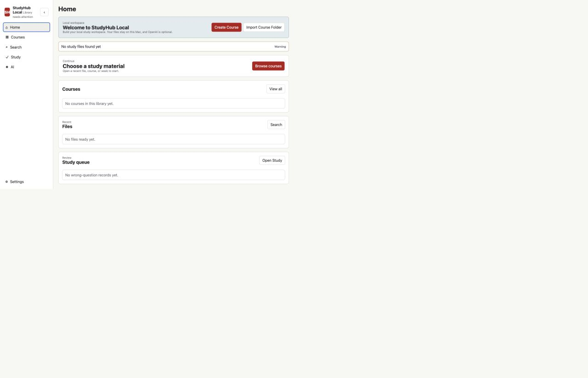
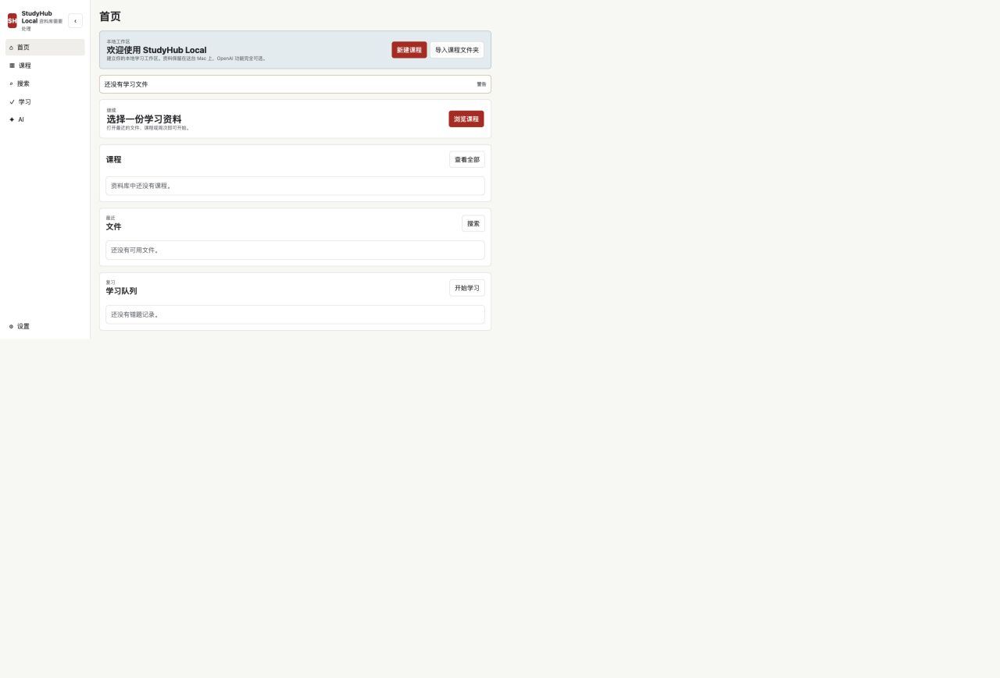

# StudyHub Local

[](https://github.com/langming58-hash/studyhub-local/releases/tag/v0.3.0-beta.1)
[](LICENSE)
[](https://github.com/langming58-hash/studyhub-local/actions/workflows/ci.yml)


[简体中文](README.zh-CN.md)

## Download

**[Download for macOS](https://github.com/langming58-hash/studyhub-local/releases/tag/v0.3.0-beta.1)** · [Latest releases](https://github.com/langming58-hash/studyhub-local/releases) · [Source code](https://github.com/langming58-hash/studyhub-local)

| Version | Status | Mac | Minimum macOS | Signing |
| --- | --- | --- | --- | --- |
| v0.3.0-beta.1 | Prerelease | Apple Silicon only | macOS 13 Ventura | Unsigned beta, not notarized |

The downloaded app includes its local backend. A normal user does not need Git, Node.js, Python, Rust, npm, or Terminal.

### Install on macOS

1. Open the GitHub release and download `StudyHub-Local-v0.3.0-beta.1-macos-arm64.dmg`.
2. Open the DMG.
3. Drag **StudyHub Local** to **Applications**.
4. Try to open **StudyHub Local** normally.
5. Because this beta is not Developer ID signed or notarized, macOS may block the first launch. Open **System Settings -> Privacy & Security**, find the StudyHub Local message, and choose **Open Anyway**. Apple documents this standard path in [Open a Mac app from an unknown developer](https://support.apple.com/guide/mac-help/open-a-mac-app-from-an-unknown-developer-mh40616/mac).

Do not disable Gatekeeper. Terminal is not required for installation or first launch.

StudyHub Local is an early-stage, local-first workspace for course files from any university. It organizes material by Course -> Week, supports local preview and search, keeps notes and study records, and can optionally answer questions with citations from your own indexed material.

Your original files remain in a folder you control. The app starts with a clean, empty workspace: no sample courses, teacher material, test database, extracted text, or API credentials are bundled into the production runtime.

## v0.3.0-beta.1

- Clean first run: create a course or import a folder
- English and Simplified Chinese UI with system detection and a local preference
- Home, Courses, Search, Study, AI, and Settings product architecture
- Local AI conversation history, citations, notes, and teacher-question safeguards
- Public Apple Silicon DMG with a bundled backend and no end-user developer-tool requirement
- Strict production/test fixture separation
- Packaged privacy scanning and published SHA-256 checksum

This is an early unsigned beta. It is not Developer ID signed or notarized.

## Screenshots





These screenshots show an empty production workspace and contain no course material or personal information.

## Features

- Organize files by course, week/module, material type, and exercise type
- Preview PDF, text, code, images, and supported Office documents
- Search filenames and readable extracted text
- Ask AI within the current question, file, week, or course scope
- Follow citations to the source file and page/slide when reliably available
- Keep local notes, stars, conversations, practice records, and wrong-question records
- Retrieve teacher-provided questions only; StudyHub does not generate practice questions
- Run without OpenAI for local organization, preview, search, notes, and study records

## Source Development Requirements

- Git, Node.js/npm, and Python 3
- Poppler (`pdftotext` and `pdfinfo`) recommended for PDF text extraction
- LibreOffice optional for higher-fidelity PowerPoint and Word previews

## Quick Start

```bash
git clone https://github.com/langming58-hash/studyhub-local.git
cd studyhub-local
npm install
python3 -m pip install -r requirements.txt
npm run dev
```

Open the printed loopback URL, usually `http://127.0.0.1:8765`. On first launch, create a course or import an existing course folder. StudyHub does not scan unrelated folders automatically.

On macOS, `Start StudyHub Local.command` is a convenience launcher for source development. Most users should install the DMG above.

## Study Library

Keep real study files outside the repository. A typical structure is:

```text
~/StudyLibrary/
├── CS101 - Programming Fundamentals/
│   ├── Week 01/
│   │   ├── 01 Course Materials/Lecture/
│   │   └── 02 Exercises/Tutorial/
│   └── Week 02/
└── ECON201 - Macroeconomics/
```

Common formats include PDF, DOCX, PPTX, TXT, CSV, Python, R, and IPYNB where local extraction support is available. Original files remain authoritative and are never converted into unrelated study formats.

## Optional OpenAI

OpenAI is server-side and optional. Create `.env.local` only on your own machine:

```text
OPENAI_API_KEY=
OPENAI_MODEL=gpt-5.4
```

Never place keys in frontend code, screenshots, logs, issues, or commits. AI uses the narrowest reasonable context first: current question, file, week, then course. If sources do not support an answer, StudyHub returns a no-source response instead of inventing course content. Vector search is an optional retrieval layer; the local original file remains the source of truth.

## Privacy And Security

- Loopback-only by default, with no telemetry by default
- Host, exact same-origin, CSRF, request-size, and file-root checks
- Runtime databases, extracted text, previews, logs, secrets, and study files stay out of Git
- Read-only MCP boundary for local integrations
- Privacy and security acceptance suites run in normal CI

Read [SECURITY.md](SECURITY.md), [PRIVACY.md](PRIVACY.md), and [Architecture](docs/ARCHITECTURE.md) before changing trust boundaries.

## Development

Synthetic fixtures live only under `tests/fixtures/` and are injected by tests. They must never be bundled into production resources.

```bash
npm run ci
npm run desktop:check
```

Desktop prototype build and packaged acceptance:

```bash
npm run desktop:setup
npm run desktop:build
npm run desktop:test:packaged
```

See [Development](docs/DEVELOPMENT.md), [Desktop Architecture](docs/DESKTOP_ARCHITECTURE.md), [macOS Trusted Distribution](docs/MACOS_TRUSTED_DISTRIBUTION.md), and [Contributing](CONTRIBUTING.md).

## License

[MIT](LICENSE)
