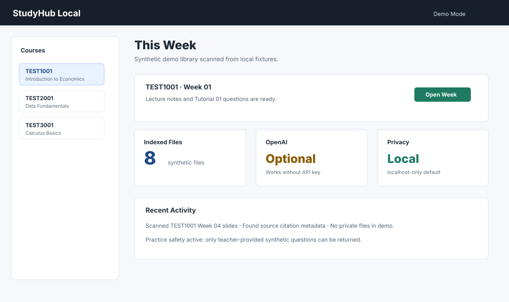
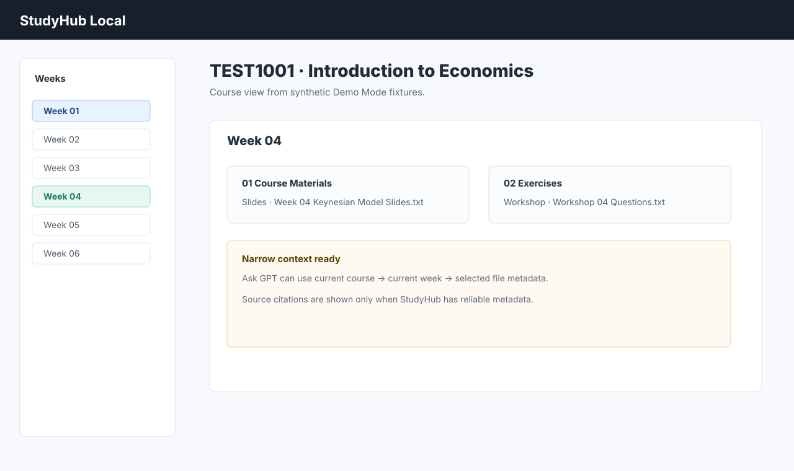
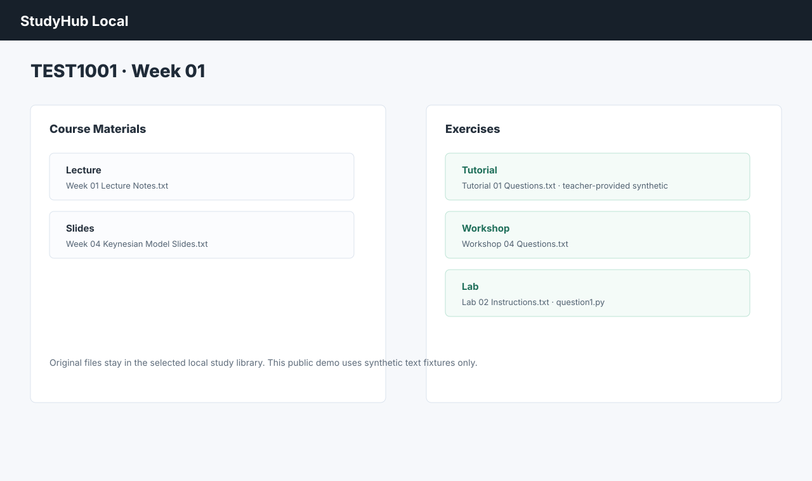
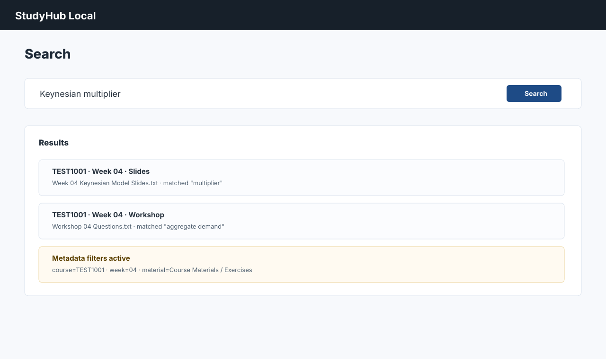
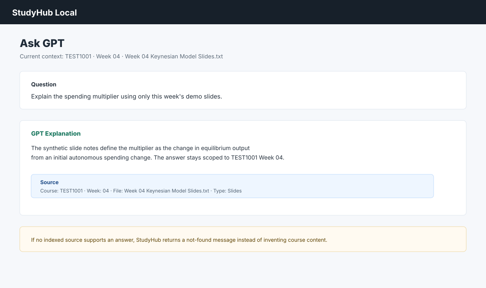
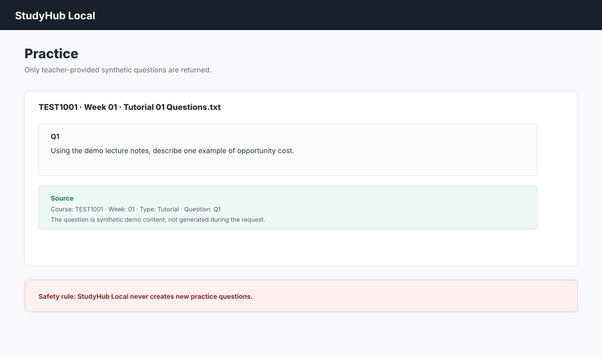
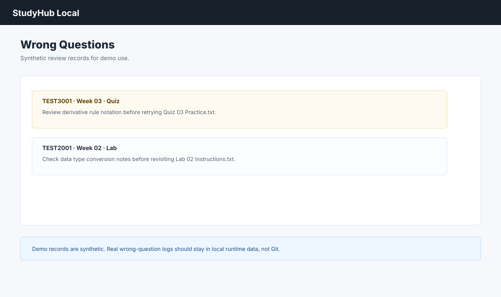
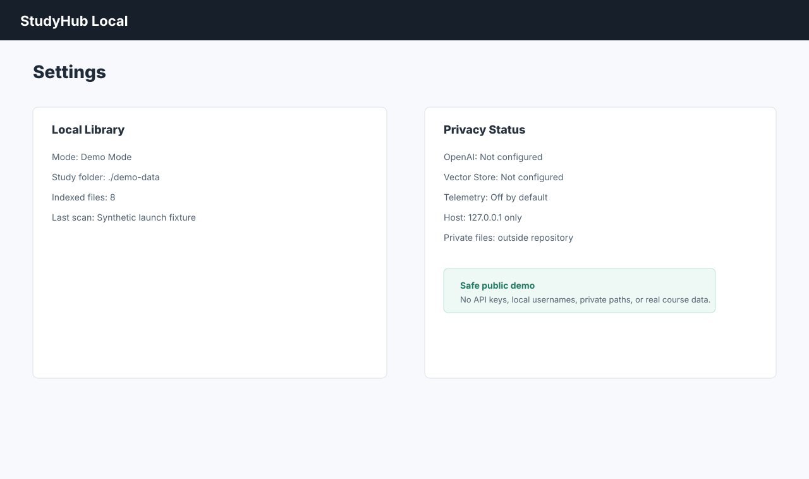

# StudyHub Local

[](https://github.com/langming58-hash/studyhub-local/releases/tag/v0.1.4)
[](LICENSE)
[](https://github.com/langming58-hash/studyhub-local/actions/workflows/ci.yml)


A private, local-first study hub for organizing course materials and using AI with source-grounded academic context.

StudyHub Local is an early-stage open-source project that became useful enough to share. It keeps your course files outside the repository, runs on localhost only, has no telemetry by default, works without an OpenAI API key, includes a synthetic demo, and offers optional source-grounded AI plus a read-only MCP boundary for local integrations.

[Quick Start](#quick-start) · [Demo Mode](#demo-mode) · [Screenshots](#screenshots) · [Privacy](#privacy-at-a-glance) · [Security](SECURITY.md)

## At a Glance

- Local-first course and week browser for PDFs, slides, tutorials, labs, quizzes, notes, and code files
- Original files remain the source of truth in your own local study folder
- Demo Mode is enabled by default and uses only synthetic `TEST1001`, `TEST2001`, and `TEST3001` fixtures
- OpenAI integration is optional and server-side only
- Ask GPT uses narrow context by default and shows source citations
- Practice question safety: no new practice questions are generated by the app
- Read-only MCP endpoint for local tools, with filesystem containment
- Python standard-library backend with static frontend files

## Screenshots

All images below are synthetic Demo Mode captures. They do not contain real course material, university branding, API keys, usernames, private paths, or personal data.

















Demo flow preview:


## Quick Start

```bash
git clone https://github.com/langming58-hash/studyhub-local.git
cd studyhub-local
cp .env.example .env.local
npm install
npm run dev
```

Open [http://127.0.0.1:8765](http://127.0.0.1:8765).

Demo Mode is enabled by default. No OpenAI API key is required. You can browse the synthetic demo courses, search materials, inspect practice records, and explore the interface before connecting your own local study folder.

`npm install` is intentionally lightweight. The app currently uses Python standard-library backend code and static frontend files.

## Demo Mode

Demo Mode is configured in `.env.example`:

```text
DEMO_MODE=true
DATABASE_PATH=./data/studyhub.sqlite
```

When `DEMO_MODE=true` and no `STUDY_LIBRARY_PATH` is set, StudyHub Local scans `./demo-data`. The included fixtures are synthetic and public-safe:

- `TEST1001 - Introduction to Economics`
- `TEST2001 - Data Fundamentals`
- `TEST3001 - Calculus Basics`

Demo Mode shows course/week browsing, Course Materials, Exercises, Search, Ask GPT UI, practice question records, and a synthetic Wrong Questions example.

## Use Your Own Local Study Library

Your real course materials should stay outside this repository. To switch from Demo Mode to your own local folder, edit `.env.local`:

```text
DEMO_MODE=false
STUDY_LIBRARY_PATH=~/StudyLibrary
DATABASE_PATH=./data/studyhub.sqlite
```

Recommended folder shape:

```text
StudyLibrary/
├── TEST1001 - Example Course/
│   ├── Week 01/
│   │   ├── 01 Course Materials/
│   │   │   └── Lecture/
│   │   └── 02 Exercises/
│   │       ├── Tutorial/
│   │       ├── Workshop/
│   │       ├── Quiz/
│   │       └── Lab/
│   └── Week 02/
└── TEST2001 - Another Course/
```

Supported readable formats include PDF, DOCX, PPTX, TXT, CSV, Python, R, and IPYNB where local extraction support is available.

Imported active web files such as HTML, XHTML, XML, and SVG are treated as untrusted content in preview and displayed as escaped plaintext rather than executable same-origin pages.

## Who Is This For?

- Students with many PDFs, slides, tutorials, labs, quizzes, and worksheets
- People who want course materials organized by course and week on their own machine
- Students who want AI help grounded in their own indexed materials
- People who do not want their study folder stored in a cloud dashboard by default
- Developers interested in local-first education tools, source-grounded retrieval, and privacy boundaries

StudyHub Local is a tool for organizing and querying material. It does not guarantee learning outcomes and is not a substitute for understanding the course.

## Why StudyHub Local?

Study material often ends up scattered across folders, browser downloads, LMS pages, notes apps, and chat transcripts. StudyHub Local keeps the model simpler:

- Local files remain authoritative
- Course/week structure is explicit
- Search works across indexed files
- AI is optional, source-grounded, and narrow by default
- Teacher-provided question safety is built into the Ask GPT path
- Citations point back to course, week, filename, and page/slide/question where reliable
- MCP tools are read-only and scoped to the configured library

## Privacy at a Glance

- Study files remain on your machine during normal local use
- No telemetry by default
- The server refuses non-loopback network binding
- Private course files are excluded from the repository by design
- OpenAI integration is optional
- If OpenAI/vector indexing is enabled, selected file content is sent to OpenAI for retrieval
- `.env.local`, runtime databases, extracted text, private logs, and vector metadata must stay untracked

This means the app is local-first, not "100% local" when optional OpenAI features are enabled.

## Security Summary

See [SECURITY.md](SECURITY.md) for details. The public release includes:

- Loopback-only binding
- Host-header and DNS-rebinding protection
- Exact same-origin checks for mutating browser requests
- CSRF token bootstrap through `/api/session`
- Filesystem root containment
- Request-size limits
- Active HTML/SVG preview isolation
- Read-only MCP boundary
- Privacy scanner and regression tests in CI

Do not expose StudyHub Local with ngrok, Cloudflare Tunnel, port forwarding, public hosting, or a reverse proxy unless you perform a separate security review for your own deployment.

## Optional OpenAI Setup

OpenAI is optional. Without an API key, the app still runs locally with course browsing, metadata search, source previews, practice records, and Demo Mode.

To enable Ask GPT with the OpenAI API, keep the key server-side in `.env.local` or your environment:

```text
OPENAI_API_KEY=
OPENAI_MODEL=gpt-5.4
```

Then run:

```bash
npm run study:scan
npm run study:ai-sync
```

Rules:

- Never put API keys in frontend code, screenshots, issues, databases, logs, or GitHub
- Vector-store upload is opt-in and should only be used with materials you are authorized to process
- OpenAI/vector indexing sends selected indexed file content and safe metadata to OpenAI for retrieval
- Safe metadata excludes local absolute paths, local database paths, cache paths, and provider IDs from user-facing responses

## Ask GPT

Ask GPT uses the narrowest reasonable context:

1. Current Question
2. Current File
3. Current Week
4. Current Course

Every course-related answer should be grounded in indexed materials. If no source is found, the app returns:

```text
I couldn't find this in the currently indexed official course materials.
```

## Question Safety

StudyHub Local must never generate new practice questions.

If a user asks for practice questions and none are detected in indexed teacher-provided or demo teacher-style files, the app returns:

```text
No suitable teacher-provided question was found in the indexed official course materials.
```

If an official solution exists, it is labeled `Official Teacher Solution`. If no solution exists, AI reasoning must be labeled separately.

## MCP

The read-only MCP endpoint is available for local integrations. It is designed to:

- Listen on localhost
- Restrict file access to the configured study library
- Deny path traversal
- Reject hostile non-loopback `Host` headers
- Require same-origin CSRF protection for HTTP POST requests
- Avoid returning local absolute paths or provider IDs
- Expose read-only tools such as list, search, fetch, and question lookup

Remote MCP exposure is not enabled by default.

## Known Limitations

- Early-stage project; expect rough edges
- Local-only by design, not a typical LAN self-hosted service
- OpenAI features require a separate OpenAI API account and billing
- Document extraction quality varies by format and by locally available tools
- Some preview behavior depends on browser support and local file type support
- Canvas import workflows may require user authentication and are not a login bypass
- Not affiliated with any university, Canvas, or learning-management-system provider

## Roadmap

- Cross-platform launcher polish
- Better onboarding for custom StudyLibrary folders
- More robust PDF, DOCX, and PPTX extraction metadata
- Improved search ranking and filters
- More synthetic Demo Mode examples
- Accessibility improvements
- Broader automated UI coverage
- Optional integrations that preserve local-first defaults

No roadmap item has a promised date.

## Development

```bash
npm run lint
npm run test
npm run build
npm run ci
```

The test suite uses synthetic fixtures and mocked OpenAI behavior. CI must not require a real `OPENAI_API_KEY`.

## Contributing

Issues, feedback, and PRs are welcome. Please read [CONTRIBUTING.md](CONTRIBUTING.md), use synthetic fixtures only, and do not attach private course files, teacher questions, official solutions, API keys, cookies, logs, SQLite databases, extracted text, vector metadata, or screenshots with personal information.

If you find the project useful, a GitHub star helps others discover it.

## License

MIT. See [LICENSE](LICENSE).
