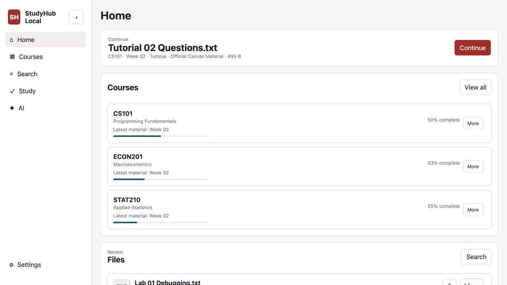
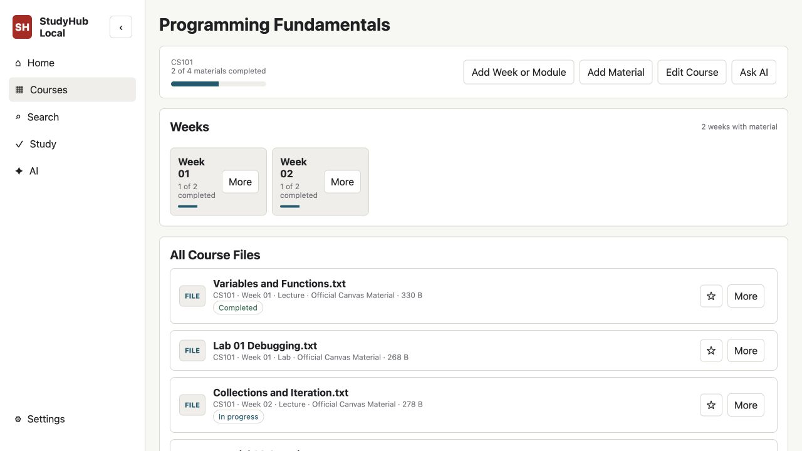
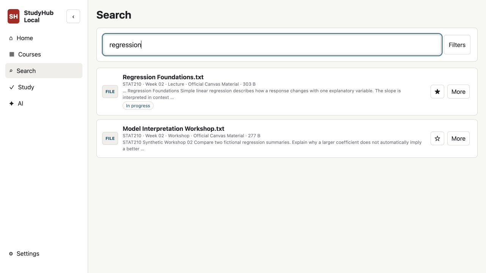
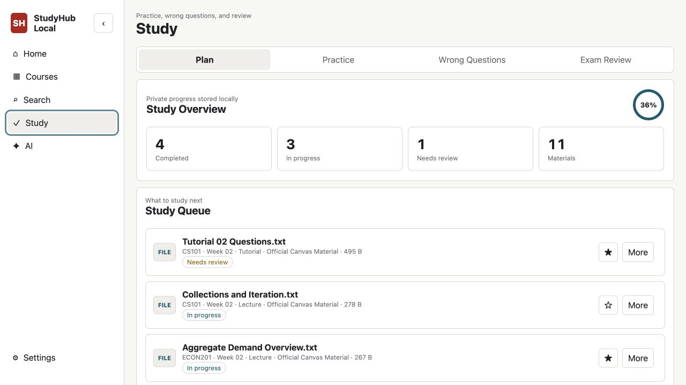
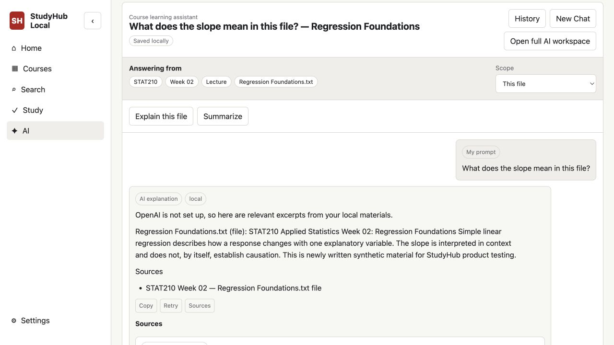
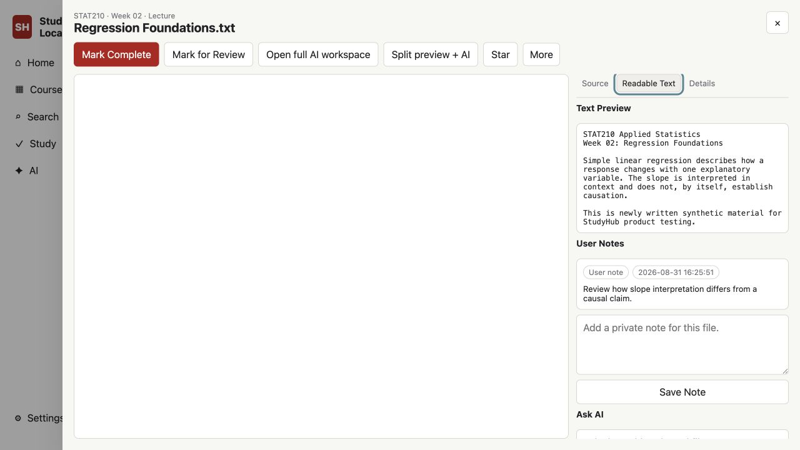
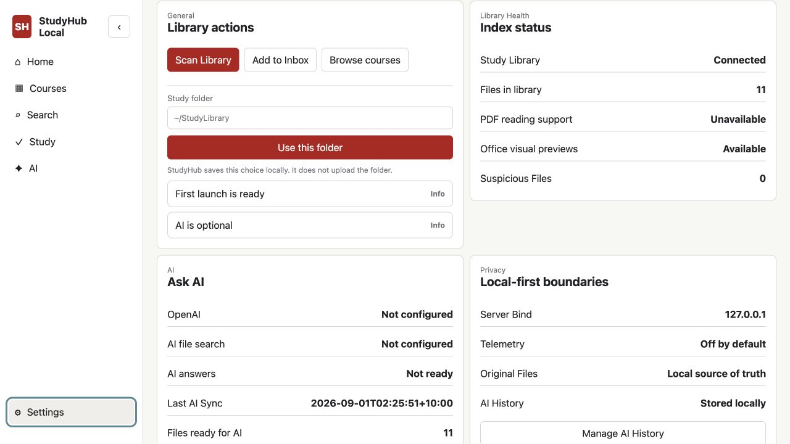

# StudyHub Local

[](https://github.com/langming58-hash/studyhub-local/releases/tag/v0.2.0)
[](LICENSE)
[](https://github.com/langming58-hash/studyhub-local/actions/workflows/ci.yml)


[English](README.md)

StudyHub Local 把分散在文件夹里的大学课程资料变成一个私密、可搜索的学习工作区，并提供进度、复习队列、笔记和可选的来源型 AI。



## 为什么做 StudyHub Local

- **把散乱资料放回同一套结构。** 按“课程 -> 周次 -> 资料 / 练习”浏览，同时保留原文件和原格式。
- **不只浏览文件，也形成学习闭环。** 记录开始与完成状态、标记待复习资料，并从本地学习队列继续。
- **AI 回答必须可追溯。** 在当前文件、周次或课程范围提问，再从来源引用回到已索引资料；OpenAI 完全可选。

## 核心能力

- 本地整理 PDF、Office、文本、代码、CSV、R 与 Notebook 课程文件
- 按课程、周次和资料类型筛选文件名及已提取正文
- 资料进度、待复习标记、课程/周次汇总、练习与错题记录
- 私人笔记、收藏、最近文件和本地 AI 对话历史
- 最窄上下文的来源型 AI 与老师原题保护
- 干净首启、English / 简体中文界面，默认无遥测

## 产品展示

下面所有有内容的截图都来自 `tests/fixtures/` 中的纯合成资料，不包含真实课程、账号、API key 或私人路径。

<table>
  <tr>
    <td width="50%"><strong>课程与周次进度</strong><br></td>
    <td width="50%"><strong>本地全文搜索</strong><br></td>
  </tr>
  <tr>
    <td width="50%"><strong>学习计划与复习队列</strong><br></td>
    <td width="50%"><strong>带来源上下文的 AI 回答</strong><br></td>
  </tr>
  <tr>
    <td width="50%"><strong>可读正文与私人笔记</strong><br></td>
    <td width="50%"><strong>本地健康状态与设置</strong><br></td>
  </tr>
</table>

## 本地优先模型

```text
你的 StudyLibrary 文件夹（唯一权威来源）
  -> 本地扫描与正文提取
  -> 本地 SQLite 元数据、搜索、笔记与进度
  -> localhost 界面
  -> 可选的服务端 OpenAI Responses API / file search
```

原始资料始终保留在你控制的文件夹中。运行数据库、提取正文、预览缓存和 AI 历史都留在本机，并由 Git 忽略。Vector Search 即使启用，也只是检索层，不会变成第二套权威资料库。

数据模型与信任边界见 [架构说明](docs/ARCHITECTURE.md) 和 [Study Engine](docs/STUDY_ENGINE.md)。

## 快速开始

```bash
git clone https://github.com/langming58-hash/studyhub-local.git
cd studyhub-local
npm install
python3 -m pip install -r requirements.txt
npm run dev
```

打开终端输出的 loopback 地址，通常是 `http://127.0.0.1:8765`，然后新建课程或选择学习资料文件夹。StudyHub 不会自动扫描无关目录。

需要 Git、Node.js/npm 和 Python 3。建议安装 Poppler（`pdftotext`、`pdfinfo`）提取 PDF 正文；LibreOffice 仅在需要更高保真的 PowerPoint / Word 预览时使用。

当前公开版本仍为 **v0.2.0**，只发布源码，不附带未经签名或公证的 macOS app / DMG。`Start StudyHub Local.command` 只是源码安装的便捷启动器，不是已签名桌面正式版。

## 学习资料库

真实学习资料必须放在仓库外。推荐结构示例：

```text
~/StudyLibrary/
├── CS101 - Programming Fundamentals/
│   ├── Week 01/
│   │   ├── 01 Course Materials/Lecture/
│   │   └── 02 Exercises/Tutorial/
│   └── Week 02/
└── ECON201 - Macroeconomics/
```

原文件始终是权威来源，不会被转换成与课程无关的格式。

## 可选 OpenAI

OpenAI 只在服务端运行，而且完全可选。只在你自己的电脑创建 `.env.local`：

```text
OPENAI_API_KEY=
OPENAI_MODEL=gpt-5.4
```

不要把 key 放进前端、截图、日志、Issue 或提交。AI 默认从最窄范围开始：当前题目、文件、周次，再到课程。如果索引资料不足，StudyHub 会返回“没有来源”，不会编造课程内容，也不会生成新的练习题。

## 干净首启

生产版本第一次打开时为空，不捆绑示例课程、老师资料、测试数据库、提取正文或凭证。

| English | 简体中文 |
| --- | --- |
|  |  |

## 隐私与安全

- 默认只监听 loopback，默认无遥测
- 校验 Host、精确 same-origin、CSRF、请求大小与文件根目录
- 隐私 CI 拒绝运行数据、密钥、日志和课程资料
- 主动内容预览与受信任应用源隔离
- MCP 只提供本地只读边界

更改信任边界前，请阅读 [SECURITY.md](SECURITY.md) 和 [PRIVACY.md](PRIVACY.md)。

## 开发

合成测试夹具只允许放在 `tests/fixtures/` 下，不能打进生产资源。

```bash
npm run ci
npm run desktop:check
```

另见 [开发说明](docs/DEVELOPMENT.md)、[桌面架构](docs/DESKTOP_ARCHITECTURE.md)、[路线图](docs/ROADMAP.md) 和 [贡献指南](CONTRIBUTING.md)。

## License

[MIT](LICENSE)
